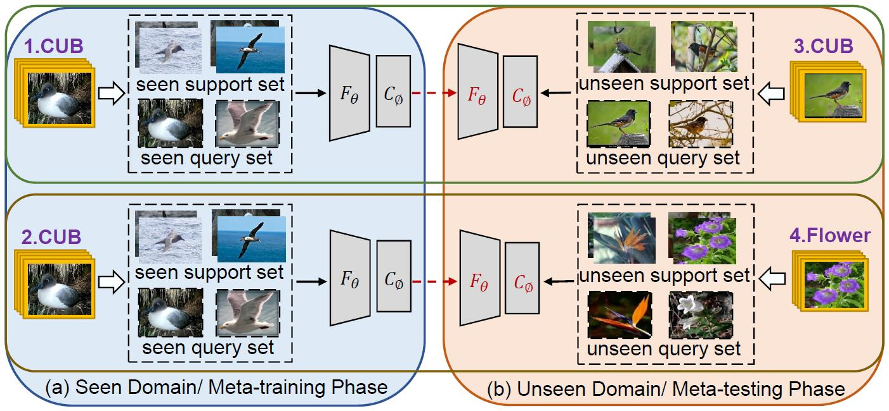

# [Domain Generalized Few-shot Image Classification Via Meta Regularization Network](https://ieeexplore.ieee.org/document/9747620)

This code implements the MRN algorithm.

if you find this repository useful in your research, please cite the following paper:

```
@inproceedings{min2022mrn,
  title={Domain Generalized Few-shot Classification via Meta Regularization Network},
  author={Min, Zhang and Siteng, Huang and Donglin, Wang},
  booktitle={IEEE International Conference on Acoustics, Speech and Signal Processing (ICASSP)}
  year={2022} 
}
```



## Abstract

In few-shot image classification scenarios, meta-learning methods aim to learn transferable feature representations extracted from seen domains (base classes) in the meta-training phase and quickly adapt to unseen domains (novel classes) in the meta-testing phase. However, when seen and unseen domains have a large discrepancy, existing approaches do not perform well due to the incapability of generalizing to
unseen domains. In this paper, we investigate the challenging domain generalized few-shot image classification problem. We design an Meta Regularization Network (MRN) to learn a domain-invariant discriminative feature space, where a learning to learn update strategy is used to simulate domain shifts caused by seen and unseen domains. The simulation trains the model to learn to reorganize the feature knowledge
acquired from seen domains to represent unseen domains. Extensive experiments and analysis show that our proposed MRN can significantly improve the generalization ability of various meta-learning methods to achieve state-of-the-art performance in domain generalized few-shot learning.

## Benchmark Datasets

CUB-200-2011, MiniImagenet, TieredImagenet and CIFAR-FS are available from [Torchmeta](https://github.com/tristandeleu/pytorch-meta).

### Requirements
 - Python 3.6 or above
 - PyTorch 1.4 or above
 - Torchvision 0.5 or above

## More Details

Please refer to file README.md under each folder.

## License

This project is licensed under the MIT License. See LICENSE for more details.

## Acknowledgement

The experiments are based on the code:
- [torchmeta](https://github.com/tristandeleu/pytorch-meta) for few-shot image classification;
